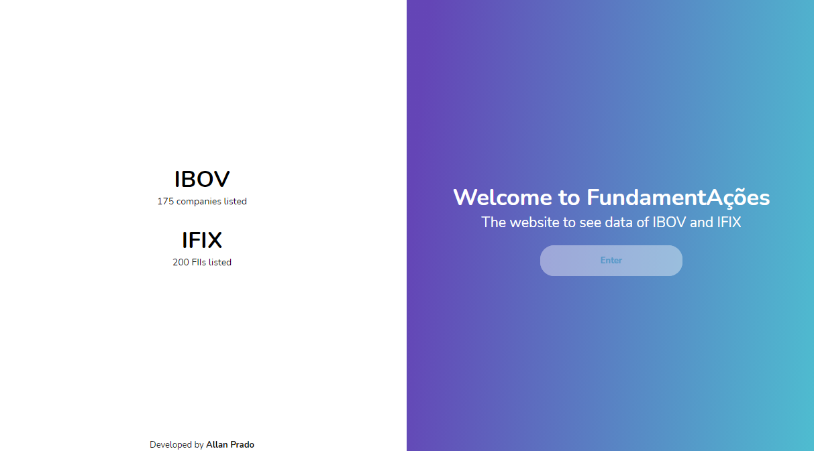

# 🚀 FundamentAções - Under development / Node.js

<h1>
    
</h1>

## 📖 About

API to see datas of IBOV and IFIX!

<br>

---

<br>

## 💾 Technologies and resources used

- HTML, CSS, JavaScript
- NodeJS
    - [Express](https://expressjs.com/pt-br/api.html)
    - [HBS](https://handlebarsjs.com/)
    - [request](https://www.npmjs.com/package/request)
    - [csvtojson](https://www.npmjs.com/package/csvtojson)

<br>

---

<br>

## 📁 How to download the project

```bash
$ git clone https://github.com/LanPRD/ibov

$ cd IBOV

$ npm install

$ npm start
```

<br>

<h6 align="center" font-size="11">Developed by <strong>Allan Prado</strong></h6>