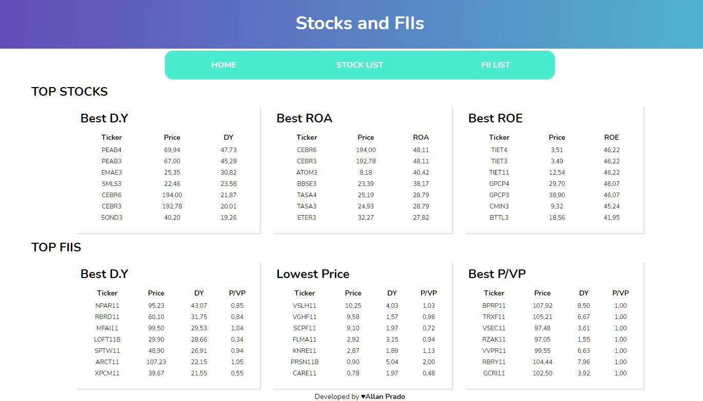

# Frontend ReactJS - Check IBOV Datas

<h1 align="center">
    
</h1>

## Available Scripts

#### `npm start`

Runs the app in the development mode.\
Open [http://localhost:8080](http://localhost:8080) to view it in the browser.

The page will reload if you make edits.\
You will also see any lint errors in the console.

<br>

---

<br>

## 📖 About

Practicing knowledges about ReactJS and NodeJS.

<br>

---

<br>

## 💾 Technologies and resources used

- ReactJS
  - [React Router](https://reactrouter.com/)
  - [Context](https://pt-br.reactjs.org/docs/context.html)
  - [Styled Components](https://styled-components.com/)
  - [Axios](https://www.npmjs.com/package/axios)

<br>

---

<br>

## 📁 How to download the project

<br>

> This project needs this [Backend](https://github.com/LanPRD/ibov-backend-nodejs)

<br>

```bash
$ git clone https://github.com/LanPRD/ibov-frontend-reactjs.git

$ cd ibov

$ npm install

$ npm start
```

<br>

<h6 align="center" font-size="11">Developed by <strong>Allan Prado</strong></h6>
